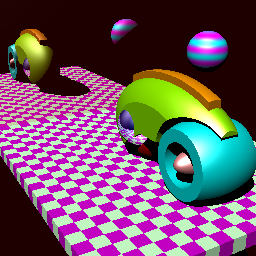
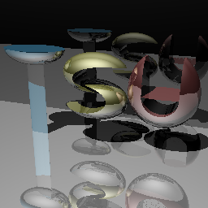

redesigned-giggle
====

https://github.com/esumii/min-caml/blob/master/min-rt/RayTrace.cxx をpythonで書き直したもの。ほとんどデッドコピー。

classの構築方法を飲み込めていない頃に作ったので、構成が色々とひどい。

## 作例

### [contest.sld](https://github.com/esumii/min-caml/blob/master/min-rt/contest.sld)

いい感じ（自画自賛）。

### [tsu.sld](https://github.com/esumii/min-caml/blob/master/min-rt/tsu.sld)

"U"の真ん中に変な膜が残る。

## 使い方
以下の関数を上から順に実行する。

### clear_global()
- 演算に用いる内部変数を初期化する。

### load_data(*sldfile*)
- 与えられた*sldfile*から、各プリミティブのデータを読み込む。

### mainloop(*output='result', shadow_flg=True*)
- load_data(*sldfile*)で読み込んだデータについてレイトレーシングを実行する。
    - 結果を ./*output*.png に出力する。
    - 影を描画するかどうかは*shadow_flg*で指定する。

## 入力ファイルフォーマット
いつか纏めたい。

